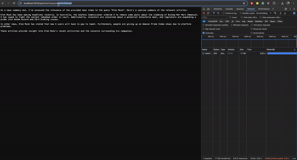

# GenAI News Search Agent

A quick implementation of a GenAI News Summary agent using Llama-3 over Groq. Retrieves news and provides summaries under 6 seconds.

## How to use?

### Install requirements

```
pip install -r server/requirements.txt
```

### Create environment file and add environment variables

Create a `.env` file and add the following contents.

```
GROQ_API_KEY="YOUR_GROQ_API_KEY"
GROQ_MODEL_NAME="llama3-8b-8192"

NEWS_API_KEY="YOUR_NEWS_API_KEY"
NEWS_BASE_URL="https://newsdata.io/api/1/"
```

### Start the FastAPI Server

```
python server/app.py
```

## Demo

The server will run on port number $8899$. You can then interact with the `/api/news` endpoint int the following manner.

